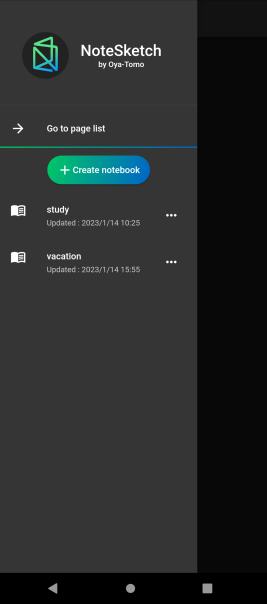
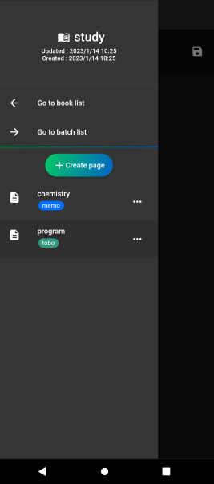
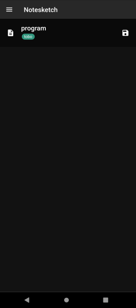

# NoteSketch

    

# tech

- flutter
- dart
- sqlite
- riverpod

# view images

  

# usage

## notebook list

You can manage pages by grouping them into books.

## notepage list

You can manage your pages by creating batches and attaching them to your pages.
